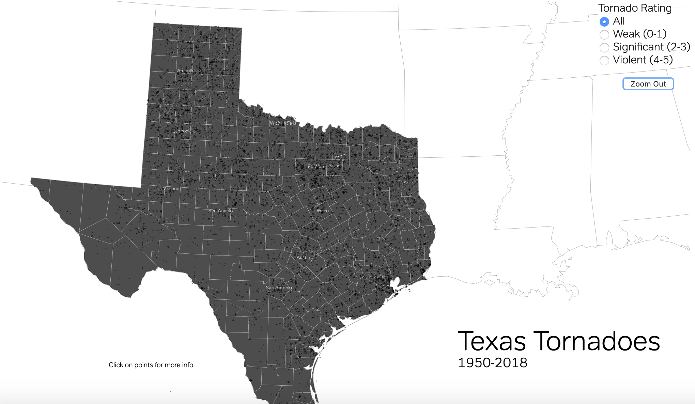
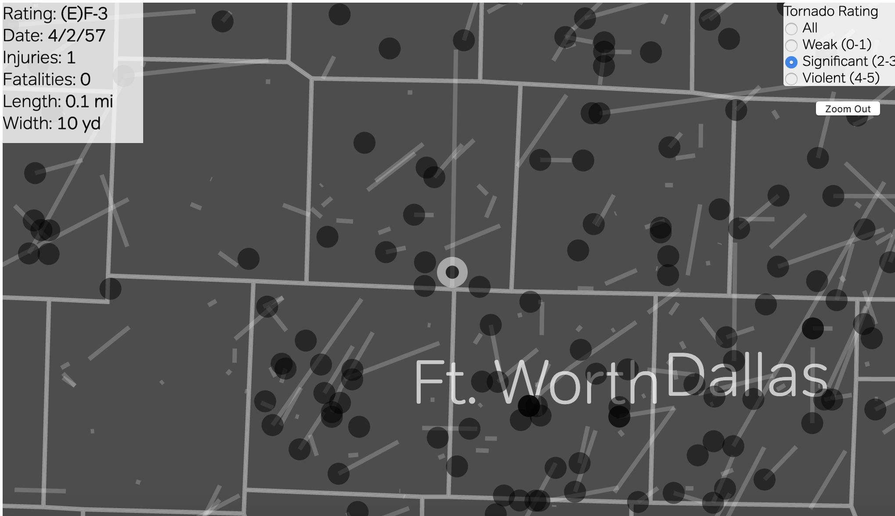

# 1950-2018 Texas Tornadoes

This repo contains an html/js file to visualize a dataset of nearly 70 years of Texas tornado data. 
Live Version: [Texas Tornadoes](http://untoldsky.com/tor-paths/)

---
### Visualization

The code utilizes d3.js to read both the tornado data and geographic topojson data to plot a map with historic tornado tracks from 1950 through 2018. Additionally, it adds a few event listeners to the svg elements such that tornado startpoints can be clicked for further information.

---
### Examples

##### Full map view of all tornadoes

##### Zoomed in for a particular tornado

